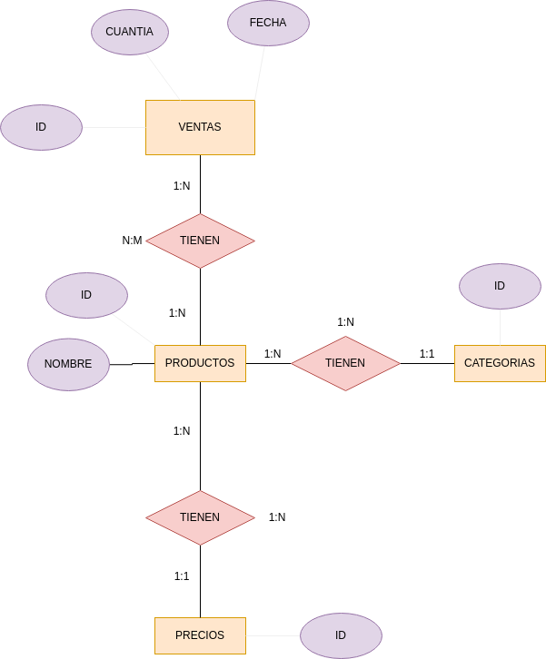
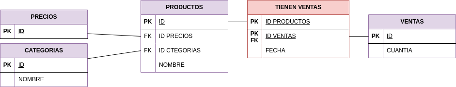

# PASOS:
## Paso 1: Creación de la BBDD
* Creamos con el siguente contenido el fichero supermercado-dump.sql.
```sql
CREATE TABLE productos (
    id INTEGER PRIMARY KEY,
    nombre TEXT,
    categoria TEXT,
    precio REAL
);

CREATE TABLE ventas (
    id INTEGER PRIMARY KEY,
    id_producto INTEGER,
    cantidad INTEGER,
    fecha DATE,
    FOREIGN KEY (id_producto) REFERENCES productos(id)
);

INSERT INTO productos (id, nombre, categoria, precio) VALUES 
    (1, 'Arroz', 'Alimentos', 2.5),
    (2, 'Leche', 'Lácteos', 1.8),
    (3, 'Pan', 'Panadería', 1.2),
    (4, 'Manzanas', 'Frutas', 3.0),
    (5, 'Pollo', 'Carnes', 5.5),
    (6, 'Huevos', 'Lácteos', 1.0),
    (7, 'Yogurt', 'Lácteos', 2.0),
    (8, 'Tomates', 'Verduras', 2.2),
    (9, 'Queso', 'Lácteos', 4.0),
    (10, 'Cereal', 'Desayuno', 3.5),
    (11, 'Papel Higiénico', 'Hogar', 1.5),
    (12, 'Cepillo de Dientes', 'Higiene', 2.0),
    (13, 'Detergente', 'Limpieza', 2.8),
    (14, 'Galletas', 'Snacks', 1.7),
    (15, 'Aceite de Oliva', 'Cocina', 4.5),
    (16, 'Café', 'Bebidas', 5.0),
    (17, 'Sopa enlatada', 'Conservas', 2.3),
    (18, 'Jabón de Baño', 'Higiene', 1.2),
    (19, 'Botellas de Agua', 'Bebidas', 1.0),
    (20, 'Cerveza', 'Bebidas', 3.8);

INSERT INTO ventas (id_producto, cantidad, fecha) VALUES 
    (1, 5, '2024-01-17'),
    (2, 3, '2024-01-17'),
    (4, 2, '2024-01-17'),
    (5, 1, '2024-01-17'),
    (6, 10, '2024-01-18'),
    (8, 4, '2024-01-18'),
    (10, 2, '2024-01-18'),
    (14, 7, '2024-01-19'),
    (16, 3, '2024-01-19'),
    (18, 6, '2024-01-20');
```

## Paso 2 Lectura del fichero sql.
Entramos en sqlite a través del siguiente comando:

```sql
sqlite3 tarea4.db 
```

## Paso 3: Realización de consultas

* Realiza el diagrama ER de la BBDD supermercado.

  
* Realiza el diagrama MR de la BBDD supermercado.



* Indica si la BBDD esta normalizada hasta la 3ª forma normal:
   * La BBDD no esta normalizada ya que no cumple la 3FN

## Paso 4: Responde a las siguientes cuestiones

1. Mostrar todos los productos de la categoría "Bebidas".
```sql
SELECT * FROM productos  WHERE categoria = 'Bebidas';
+----+------------------+-----------+--------+
| id |      nombre      | categoria | precio |
+----+------------------+-----------+--------+
| 16 | Café             | Bebidas   | 5.0    |
| 19 | Botellas de Agua | Bebidas   | 1.0    |
| 20 | Cerveza          | Bebidas   | 3.8    |
+----+------------------+-----------+--------+
```

2. Listar los productos ordenados por precio de forma descendente.
```sql
SELECT nombre, categoria, precio FROM productos GROUP BY precio;
+-----------------+-----------+--------+
|     nombre      | categoria | precio |
+-----------------+-----------+--------+
| Huevos          | Lácteos   | 1.0    |
| Pan             | Panadería | 1.2    |
| Papel Higiénico | Hogar     | 1.5    |
| Galletas        | Snacks    | 1.7    |
| Leche           | Lácteos   | 1.8    |
| Yogurt          | Lácteos   | 2.0    |
| Tomates         | Verduras  | 2.2    |
| Sopa enlatada   | Conservas | 2.3    |
| Arroz           | Alimentos | 2.5    |
| Detergente      | Limpieza  | 2.8    |
| Manzanas        | Frutas    | 3.0    |
| Cereal          | Desayuno  | 3.5    |
| Cerveza         | Bebidas   | 3.8    |
| Queso           | Lácteos   | 4.0    |
| Aceite de Oliva | Cocina    | 4.5    |
| Café            | Bebidas   | 5.0    |
| Pollo           | Carnes    | 5.5    |
+-----------------+-----------+--------+

```

3. Calcular el precio total de todos los productos en la tabla "productos".
```sql
SELECT SUM(precio) AS 'Suma de precios' FROM productos;
+-----------------+
| Suma de precios |
+-----------------+
| 52.5            |
+-----------------+
```

4. Encontrar los productos con un nombre que contenga la letra 'a'.
```sql
SELECT nombre FROM productos WHERE nombre LIKE '%a%';
+------------------+
|      nombre      |
+------------------+
| Arroz            |
| Pan              |
| Manzanas         |
| Tomates          |
| Cereal           |
| Papel Higiénico  |
| Galletas         |
| Aceite de Oliva  |
| Café             |
| Sopa enlatada    |
| Jabón de Baño    |
| Botellas de Agua |
| Cerveza          |
+------------------+
```

5. Obtener la cantidad total de productos vendidos en todas las fechas.
```sql
SELECT fecha, COUNT(id_producto) as ventas_por_fecha FROM ventas GROUP BY fecha;
+------------+------------------+
|   fecha    | ventas_por_fecha |
+------------+------------------+
| 2024-01-17 | 4                |
| 2024-01-18 | 3                |
| 2024-01-19 | 2                |
| 2024-01-20 | 1                |
+------------+------------------+

```

6. Encontrar el producto más caro en cada categoría.
```sql 
SELECT DISTINCT nombre, precio, categoria FROM productos GROUP BY categoria;
+--------------------+--------+-----------+
|       nombre       | precio | categoria |
+--------------------+--------+-----------+
| Arroz              | 2.5    | Alimentos |
| Café               | 5.0    | Bebidas   |
| Pollo              | 5.5    | Carnes    |
| Aceite de Oliva    | 4.5    | Cocina    |
| Sopa enlatada      | 2.3    | Conservas |
| Cereal             | 3.5    | Desayuno  |
| Manzanas           | 3.0    | Frutas    |
| Cepillo de Dientes | 2.0    | Higiene   |
| Papel Higiénico    | 1.5    | Hogar     |
| Detergente         | 2.8    | Limpieza  |
| Leche              | 1.8    | Lácteos   |
| Pan                | 1.2    | Panadería |
| Galletas           | 1.7    | Snacks    |
| Tomates            | 2.2    | Verduras  |
+--------------------+--------+-----------+
```
 7. Listar los productos que no han sido vendidos.
 ```sql
 SELECT * from productos where id not in (SELECT p.id from productos as p, ventas as v where p.id=v.id_producto);
+----+--------------------+-----------+--------+
| id |       nombre       | categoria | precio |
+----+--------------------+-----------+--------+
| 3  | Pan                | Panadería | 1.2    |
| 7  | Yogurt             | Lácteos   | 2.0    |
| 9  | Queso              | Lácteos   | 4.0    |
| 11 | Papel Higiénico    | Hogar     | 1.5    |
| 12 | Cepillo de Dientes | Higiene   | 2.0    |
| 13 | Detergente         | Limpieza  | 2.8    |
| 15 | Aceite de Oliva    | Cocina    | 4.5    |
| 17 | Sopa enlatada      | Conservas | 2.3    |
| 19 | Botellas de Agua   | Bebidas   | 1.0    |
| 20 | Cerveza            | Bebidas   | 3.8    |
+----+--------------------+-----------+--------+

 ```

 8. Calcular el precio promedio de los productos en la categoría "Snacks".
 ```sql
 SELECT AVG(precio) FROM productos WHERE categoria='Snacks';
+-------------+
| AVG(precio) |
+-------------+
| 1.7         |
+-------------+
 ```

 9. Encontrar los productos que han sido vendidos más de 5 veces.
 ```sql
 SELECT p.nombre, v.cantidad FROM productos as p, ventas as v WHERE p.id=v.id_producto AND v.cantidad >=5;
+---------------+----------+
|    nombre     | cantidad |
+---------------+----------+
| Arroz         | 5        |
| Huevos        | 10       |
| Galletas      | 7        |
| Jabón de Baño | 6        |
+---------------+----------+
 ```

 10. Mostrar la fecha y la cantidad de ventas para cada producto.
 ```sql
 
 SELECT p.nombre, v.cantidad, v.fecha FROM productos as p, ventas as v WHERE p.id = v.id_producto;
+---------------+----------+------------+
|    nombre     | cantidad |   fecha    |
+---------------+----------+------------+
| Arroz         | 5        | 2024-01-17 |
| Leche         | 3        | 2024-01-17 |
| Manzanas      | 2        | 2024-01-17 |
| Pollo         | 1        | 2024-01-17 |
| Huevos        | 10       | 2024-01-18 |
| Tomates       | 4        | 2024-01-18 |
| Cereal        | 2        | 2024-01-18 |
| Galletas      | 7        | 2024-01-19 |
| Café          | 3        | 2024-01-19 |
| Jabón de Baño | 6        | 2024-01-20 |
+---------------+----------+------------+
 ```

 11. 11 Encontrar los productos que tienen un precio menor o igual a 2.
 ```slq
 SELECT nombre, precio FROM productos WHERE precio <= 2;
+--------------------+--------+
|       nombre       | precio |
+--------------------+--------+
| Leche              | 1.8    |
| Pan                | 1.2    |
| Huevos             | 1.0    |
| Yogurt             | 2.0    |
| Papel Higiénico    | 1.5    |
| Cepillo de Dientes | 2.0    |
| Galletas           | 1.7    |
| Jabón de Baño      | 1.2    |
| Botellas de Agua   | 1.0    |
+--------------------+--------+
 ```

 12. Calcular la cantidad total de ventas para cada fecha.
 ```sql
 SELECT DISTINCT fecha, SUM(cantidad) as total_ventas FROM ventas GROUP BY fecha; 
+------------+--------------+
|   fecha    | total_ventas |
+------------+--------------+
| 2024-01-17 | 11           |
| 2024-01-18 | 16           |
| 2024-01-19 | 10           |
| 2024-01-20 | 6            |
+------------+--------------+
 ```

 13. Listar los productos cuyo nombre comienza con la letra 'P'.
 ```sql
 SELECT nombre FROM productos WHERE (nombre LIKE 'P%');
+-----------------+
|     nombre      |
+-----------------+
| Pan             |
| Pollo           |
| Papel Higiénico |
+-----------------+
 ```

 14. Obtener el producto más vendido en términos de cantidad.
 ```slq
 SELECT p.nombre, MAX(v.cantidad) as producto_mas_vendido FROM productos as p, ventas as v WHERE p.id = v.id_producto; 
+--------+----------------------+
| nombre | producto_mas_vendido |
+--------+----------------------+
| Huevos | 10                   |
+--------+----------------------+
 ```

 15. Mostrar los productos que fueron vendidos en la fecha '2024-01-18'.
 ```sql
 SELECT p.id, p.nombre, v.fecha FROM productos as p, ventas as v WHERE v.fecha = '2024-01-18' AND p.id = v.id_producto;
+----+---------+------------+
| id | nombre  |   fecha    |
+----+---------+------------+
| 6  | Huevos  | 2024-01-18 |
| 8  | Tomates | 2024-01-18 |
| 10 | Cereal  | 2024-01-18 |
+----+---------+------------+
 ```

 16. Calcular el total de ventas para cada producto.
 ```sql
 SELECT p.id, nombre, v.cantidad from productos as p, ventas as v WHERE p.id = v.id_producto;
+----+---------------+----------+
| id |    nombre     | cantidad |
+----+---------------+----------+
| 1  | Arroz         | 5        |
| 2  | Leche         | 3        |
| 4  | Manzanas      | 2        |
| 5  | Pollo         | 1        |
| 6  | Huevos        | 10       |
| 8  | Tomates       | 4        |
| 10 | Cereal        | 2        |
| 14 | Galletas      | 7        |
| 16 | Café          | 3        |
| 18 | Jabón de Baño | 6        |
+----+---------------+----------+
 ```

 17. 17 Encontrar los productos con un precio entre 3 y 4.
 ```sql
 SELECT * from productos WHERE precio BETWEEN 3 and 4;
+----+----------+-----------+--------+
| id |  nombre  | categoria | precio |
+----+----------+-----------+--------+
| 4  | Manzanas | Frutas    | 3.0    |
| 9  | Queso    | Lácteos   | 4.0    |
| 10 | Cereal   | Desayuno  | 3.5    |
| 20 | Cerveza  | Bebidas   | 3.8    |
+----+----------+-----------+--------+
 ```

 18. Listar los productos y sus categorías ordenados alfabéticamente por categoría.
```sql
SELECT * FROM productos GROUP BY categoria;
+----+--------------------+-----------+--------+
| id |       nombre       | categoria | precio |
+----+--------------------+-----------+--------+
| 1  | Arroz              | Alimentos | 2.5    |
| 16 | Café               | Bebidas   | 5.0    |
| 5  | Pollo              | Carnes    | 5.5    |
| 15 | Aceite de Oliva    | Cocina    | 4.5    |
| 17 | Sopa enlatada      | Conservas | 2.3    |
| 10 | Cereal             | Desayuno  | 3.5    |
| 4  | Manzanas           | Frutas    | 3.0    |
| 12 | Cepillo de Dientes | Higiene   | 2.0    |
| 11 | Papel Higiénico    | Hogar     | 1.5    |
| 13 | Detergente         | Limpieza  | 2.8    |
| 2  | Leche              | Lácteos   | 1.8    |
| 3  | Pan                | Panadería | 1.2    |
| 14 | Galletas           | Snacks    | 1.7    |
| 8  | Tomates            | Verduras  | 2.2    |
+----+--------------------+-----------+--------+
```

19. Calcular el precio total de los productos vendidos en la fecha '2024-01-19'.
```sql
SELECT v.fecha, SUM(p.precio) as precio_total FROM productos as p, ventas as v WHERE v.fecha='2024-01-19' AND p.id = v.id_producto;
+------------+--------------+
|   fecha    | precio_total |
+------------+--------------+
| 2024-01-19 | 6.7          |
+------------+--------------+
```

20. Mostrar los productos que no pertenecen a la categoría "Higiene".
```sql
SELECT * FROM productos WHERE categoria != 'Higiene';
+----+------------------+-----------+--------+
| id |      nombre      | categoria | precio |
+----+------------------+-----------+--------+
| 1  | Arroz            | Alimentos | 2.5    |
| 2  | Leche            | Lácteos   | 1.8    |
| 3  | Pan              | Panadería | 1.2    |
| 4  | Manzanas         | Frutas    | 3.0    |
| 5  | Pollo            | Carnes    | 5.5    |
| 6  | Huevos           | Lácteos   | 1.0    |
| 7  | Yogurt           | Lácteos   | 2.0    |
| 8  | Tomates          | Verduras  | 2.2    |
| 9  | Queso            | Lácteos   | 4.0    |
| 10 | Cereal           | Desayuno  | 3.5    |
| 11 | Papel Higiénico  | Hogar     | 1.5    |
| 13 | Detergente       | Limpieza  | 2.8    |
| 14 | Galletas         | Snacks    | 1.7    |
| 15 | Aceite de Oliva  | Cocina    | 4.5    |
| 16 | Café             | Bebidas   | 5.0    |
| 17 | Sopa enlatada    | Conservas | 2.3    |
| 19 | Botellas de Agua | Bebidas   | 1.0    |
| 20 | Cerveza          | Bebidas   | 3.8    |
+----+------------------+-----------+--------+
```

21. Encontrar la cantidad total de productos en cada categoría.
```sql
SELECT categoria, COUNT(*) as cantidad_total FROM productos GROUP BY categoria;
+-----------+----------------+
| categoria | cantidad_total |
+-----------+----------------+
| Alimentos | 1              |
| Bebidas   | 3              |
| Carnes    | 1              |
| Cocina    | 1              |
| Conservas | 1              |
| Desayuno  | 1              |
| Frutas    | 1              |
| Higiene   | 2              |
| Hogar     | 1              |
| Limpieza  | 1              |
| Lácteos   | 4              |
| Panadería | 1              |
| Snacks    | 1              |
| Verduras  | 1              |
+-----------+----------------+
```

22. Listar los productos que tienen un precio igual a la media de precios.
```sql
X
```

23. Calcular el precio total de los productos vendidos en cada fecha. 
```sql
SELECT v.fecha, SUM(p.precio) as precio_total from productos as p , ventas as v  GROUP BY fecha;
+------------+--------------+
|   fecha    | precio_total |
+------------+--------------+
| 2024-01-17 | 210.0        |
| 2024-01-18 | 157.5        |
| 2024-01-19 | 105.0        |
| 2024-01-20 | 52.5         |
+------------+--------------+
```

24. Mostrar los productos con un nombre que termina con la letra 'o'.
```sql
SELECT * FROM productos WHERE (nombre LIKE '%o');
+----+-----------------+-----------+--------+
| id |     nombre      | categoria | precio |
+----+-----------------+-----------+--------+
| 5  | Pollo           | Carnes    | 5.5    |
| 9  | Queso           | Lácteos   | 4.0    |
| 11 | Papel Higiénico | Hogar     | 1.5    |
| 18 | Jabón de Baño   | Higiene   | 1.2    |
+----+-----------------+-----------+--------+
```

25. Encontrar los productos que han sido vendidos en más de una fecha.
```sql
X
```

26. Listar los productos cuya categoría comienza con la letra 'L'.
```sql
SELECT * FROM productos WHERE (categoria LIKE 'L%');
+----+------------+-----------+--------+
| id |   nombre   | categoria | precio |
+----+------------+-----------+--------+
| 2  | Leche      | Lácteos   | 1.8    |
| 6  | Huevos     | Lácteos   | 1.0    |
| 7  | Yogurt     | Lácteos   | 2.0    |
| 9  | Queso      | Lácteos   | 4.0    |
| 13 | Detergente | Limpieza  | 2.8    |
+----+------------+-----------+--------+
```

27. 
```sql
SELECT productos.nombre, SUM(ventas.cantidad) AS total_ventas FROM productos JOIN ventas ON productos.id = ventas.id_producto WHERE ventas.fecha = '2024-01-17' GROUP BY productos.nombre;
+----------+--------------+
|  nombre  | total_ventas |
+----------+--------------+
| Arroz    | 5            |
| Leche    | 3            |
| Manzanas | 2            |
| Pollo    | 1            |
+----------+--------------+
```

28. Mostrar los productos cuyo nombre tiene al menos 5 caracteres.
```sql
SELECT * FROM productos WHERE LENGTH(nombre) >= 5;
+----+--------------------+-----------+--------+
| id |       nombre       | categoria | precio |
+----+--------------------+-----------+--------+
| 1  | Arroz              | Alimentos | 2.5    |
| 2  | Leche              | Lácteos   | 1.8    |
| 4  | Manzanas           | Frutas    | 3.0    |
| 5  | Pollo              | Carnes    | 5.5    |
| 6  | Huevos             | Lácteos   | 1.0    |
| 7  | Yogurt             | Lácteos   | 2.0    |
| 8  | Tomates            | Verduras  | 2.2    |
| 9  | Queso              | Lácteos   | 4.0    |
| 10 | Cereal             | Desayuno  | 3.5    |
| 11 | Papel Higiénico    | Hogar     | 1.5    |
| 12 | Cepillo de Dientes | Higiene   | 2.0    |
| 13 | Detergente         | Limpieza  | 2.8    |
| 14 | Galletas           | Snacks    | 1.7    |
| 15 | Aceite de Oliva    | Cocina    | 4.5    |
| 17 | Sopa enlatada      | Conservas | 2.3    |
| 18 | Jabón de Baño      | Higiene   | 1.2    |
| 19 | Botellas de Agua   | Bebidas   | 1.0    |
| 20 | Cerveza            | Bebidas   | 3.8    |
+----+--------------------+-----------+--------+
```

29. Encontrar los productos que tienen un precio superior a la media en la tabla "productos".
```sql

```